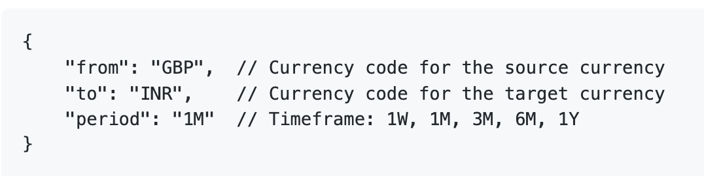
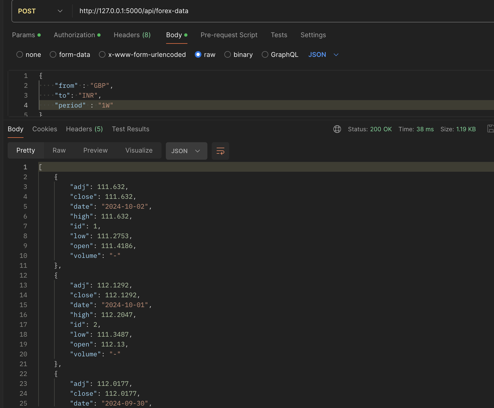

# Forex Data Scraping and API Documentation

## Overview
This project is designed to scrape forex data from Yahoo Finance and serve it through a REST API using Flask. The data is scraped and stored in a SQLite database, and the API allows querying the historical exchange rates based on currency pairs and timeframes.

## Requirements
- Python 3.x
- Flask
- Requests
- BeautifulSoup4
- Pandas
- SQLite3
You can install the required packages using pip: 
pip install Flask requests beautifulsoup4 pandas

## File Descriptions

1. Scraper.py : This file contains the function fetch_exchange_data(url) that fetches forex data from Yahoo Finance, parses it using BeautifulSoup, and returns a Pandas DataFrame containing the exchange rate information.

2. cron.py: This script periodically calls the fetch_exchange_data function from scraper.py to scrape forex data for predefined currency pairs and stores it in the SQLite database. The data is scraped once every 24 hours.

3. app.py: This file sets up a Flask API with a POST endpoint to allow users to query historical forex data based on currency pairs and specified timeframes.

## Setup Instructions

Clone the repositary
- git clone https://github.com/vansh2552/vance-assignment.git
- cd vance-assignment

Running the project
1. First, run the cron.py script to start scraping and storing the forex data:
- python cron.py
2. In a new terminal run app.py
- python app.py
The API will be accessible at http://127.0.0.1:5000

## API endpoint 
### POST /api/forex-data
This endpoint allows users to retrieve forex data based on the specified currency pairs and timeframe.

Request Body

Response
- Success (200): Returns an array of forex data for the specified currency pair and period.

